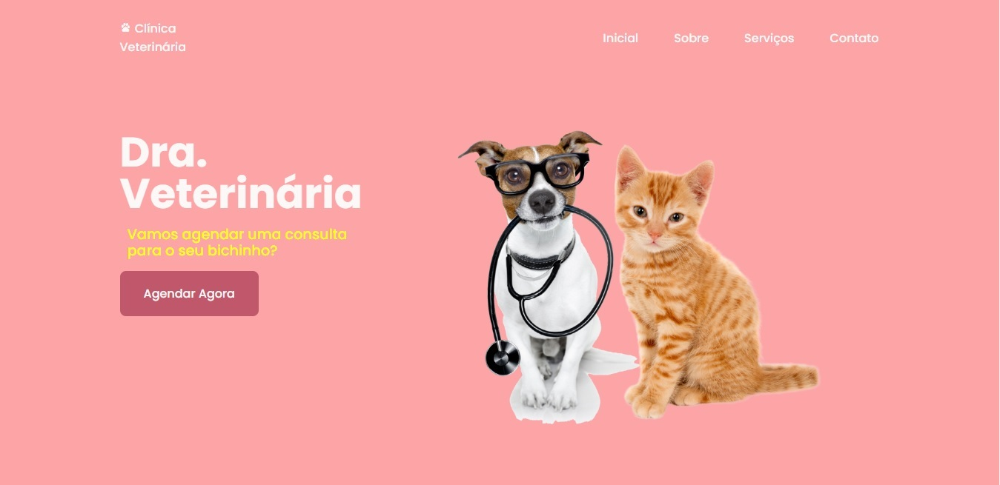

# Veterinary Website

> Site desenvolvido com o propósito de divulgar os serviços prestados por uma veterinária que oferece atendimento domiciliar e está disponível 24 horas por dia para casos de emergência. Uma seção de contato foi adicionada, para que os usuários possam contatá-la via e-mail ou, logo abaixo, através de ícones das suas redes sociais; o botão "Agendar Agora" localizado na página inicial também conduz o usuário até esse recurso de agendamento.

### ⚙️ Módulos desenvolvidos

Os módulos estão finalizados e estão listados abaixo na ordem em que foram desenvolvidos e concluídos. Por padrão, estamos aguardando os dados do provedor de serviços para permitir a configuração das seções 'Redes Sociais' e 'E-mail' com as informações do usuário titular.

- [x] Página inicial
- [x] Página Sobre
- [x] Página Serviços
- [x] Página Contato
- [x] Redes Sociais
- [x] Inclusão de Licença de uso
- [ ] Configuração / Redes Sociais
- [ ] Configuração / E-mail

## 💻 Tecnologias utilizadas

 ### Versionameto
 <a href="https://git-scm.com"> <a/> 
 ### IDE
 <a href="https://code.visualstudio.com"> <a/>  

### 👨‍💻 Autor do projeto
---

<table>
  <tr>
    <td align ="center">
      <a href="#">
         
        
          <b>Sergio Cardoso</b>
        
      </a>
    </td>    
  </tr>
</table>

 

## 📝 Licença

Esse projeto está sob licença. Veja o arquivo [LICENÇA](LICENSE.md) para mais detalhes.

[⬆ Voltar ao topo](#veterinary-website) 
